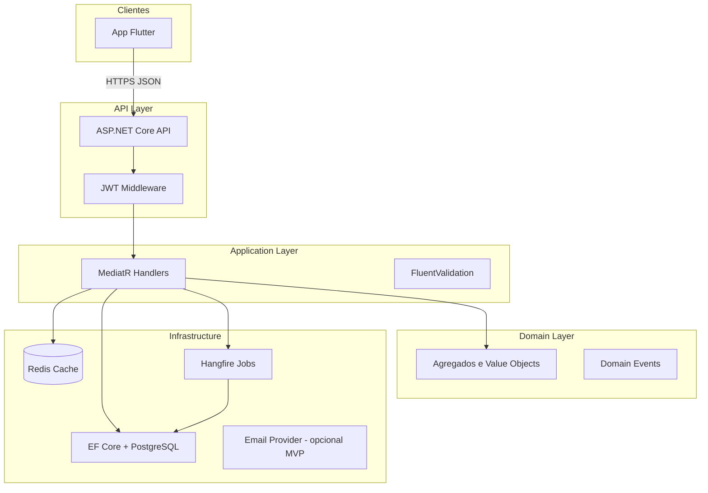
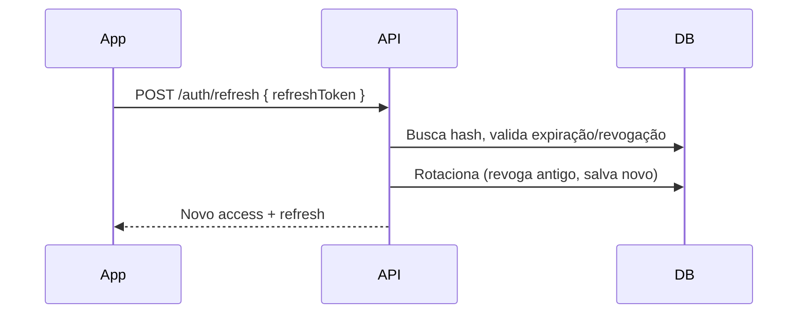

# FinanSys — Especificação Técnica de Implementação

**Versão:** 1.0  
**Data:** 2026-05-17  
**Fonte:** [PRD — Plataforma Financeira Inteligente](https://github.com/LeandroJuniorDev/finansys/wiki/PRD-%E2%80%94-Plataforma-Financeira-Inteligente-(Projeto-de-Estudos))  
**Público:** desenvolvedores responsáveis pela implementação do MVP

---

## Sumário

1. [Visão e princípios](#1-visão-e-princípios)
2. [Arquitetura de alto nível](#2-arquitetura-de-alto-nível)
3. [Bounded contexts e módulos](#3-bounded-contexts-e-módulos)
4. [Modelo de domínio](#4-modelo-de-domínio)
5. [Persistência e esquema de dados](#5-persistência-e-esquema-de-dados)
6. [API REST — contratos](#6-api-rest--contratos)
7. [Autenticação e autorização](#7-autenticação-e-autorização)
8. [Regras de negócio por feature](#8-regras-de-negócio-por-feature)
9. [CQRS, eventos e jobs](#9-cqrs-eventos-e-jobs)
10. [Dashboards e cache](#10-dashboards-e-cache)
11. [Automação e categorização](#11-automação-e-categorização)
12. [Notificações](#12-notificações)
13. [Frontend Flutter](#13-frontend-flutter)
14. [Infraestrutura e deploy](#14-infraestrutura-e-deploy)
15. [Observabilidade](#15-observabilidade)
16. [Segurança](#16-segurança)
17. [Testes](#17-testes)
18. [Plano de implementação por fases](#18-plano-de-implementação-por-fases)
19. [Decisões técnicas registradas](#19-decisões-técnicas-registradas)
20. [Glossário](#20-glossário)

---

## 1. Visão e princípios

### 1.1 O que estamos construindo

O **FinanSys** é uma plataforma financeira pessoal (PF + PJ) com foco em:

- registro e consulta de movimentações;
- cartões de crédito com faturas e parcelamentos;
- dashboards e orçamentos;
- automação de categorização;
- notificações acionáveis.

O MVP é **single-tenant por usuário** (um owner), mas o modelo inclui **Workspace** para separar contextos PF/PJ e permitir evolução futura para multiusuário.

### 1.2 Princípios arquiteturais (obrigatórios)

| Princípio | Significado na prática |
|-----------|------------------------|
| **Modular Monolith** | Um deploy, um banco, módulos com fronteiras claras; sem microserviços no MVP. |
| **DDD** | Linguagem ubíqua, agregados com invariantes, domínio sem dependência de infra. |
| **Clean Architecture** | Dependências apontam para dentro: `Domain` ← `Application` ← `Infrastructure` / `API`. |
| **CQRS** | Commands alteram estado; Queries leem projeções/DTOs; MediatR como dispatcher. |
| **Mobile-first** | API pensada para consumo Flutter; payloads enxutos; paginação cursor-based. |

### 1.3 Metas não funcionais (MVP)

| Métrica | Alvo |
|---------|------|
| Latência P95 de endpoints CRUD | < 300 ms (sem cache) |
| Latência P95 de dashboards | < 300 ms (com cache Redis) |
| Disponibilidade | best-effort em VPS única |
| Segurança | JWT + refresh rotacionado; senhas com Argon2id ou BCrypt |

---

## 2. Arquitetura de alto nível

### 2.1 Diagrama de componentes



### 2.2 Estrutura de solução (.NET)

```
finansys/
├── src/
│   ├── FinanSys.Api/                 # Controllers, middleware, DI bootstrap
│   ├── FinanSys.Application/         # Commands, Queries, Handlers, DTOs, validators
│   ├── FinanSys.Domain/              # Entidades, VOs, enums, domain events, interfaces
│   └── FinanSys.Infrastructure/      # EF, Redis, Hangfire, email, repositórios
├── tests/
│   ├── FinanSys.Domain.Tests/
│   ├── FinanSys.Application.Tests/
│   └── FinanSys.Integration.Tests/
├── mobile/
│   └── finansys_app/                 # Flutter
├── docker/
│   ├── docker-compose.yml
│   └── Dockerfile.api
└── docs/
    └── ESPECIFICACAO-TECNICA.md
```

### 2.3 Fluxo de requisição típico

1. Request HTTP → middleware de autenticação (valida JWT).
2. Controller recebe DTO → monta `Command` ou `Query`.
3. `MediatR` despacha para handler na camada Application.
4. Handler usa repositórios (interfaces no Domain/Application) e serviços de domínio.
5. Persistência via Unit of Work (EF Core `DbContext`).
6. Domain events publicados → handlers de integração (cache invalidation, notificações, jobs).
7. Response com DTO padronizado (`ApiResponse<T>`).

---

## 3. Bounded contexts e módulos

No monólito modular, cada contexto vive em pastas/namespaces distintos, com **acoplamento apenas via interfaces de aplicação ou domain events**.

| Contexto | Responsabilidade | Agregados principais |
|----------|------------------|----------------------|
| **Identity** | usuário, credenciais, refresh tokens | `User` |
| **Workspace** | espaços PF/PJ, configuração | `Workspace` |
| **Ledger** | contas, saldos, transações, transferências | `Account`, `Transaction` |
| **Catalog** | categorias e tags | `Category` |
| **Cards** | cartões, faturas, parcelas | `CreditCard`, `Invoice`, `Installment` |
| **Planning** | orçamentos | `Budget` |
| **Automation** | regras de categorização, recorrências | `Rule`, `Recurrence` |
| **Insights** | dashboards (queries agregadas) | sem agregado próprio — read models |
| **Notifications** | alertas e entregas | `Notification` |

**Regra:** contextos não acessam `DbSet` de outro módulo diretamente; use repositórios ou queries na camada Application com interfaces explícitas.

---

## 4. Modelo de domínio

### 4.1 Conceitos fundamentais

#### Workspace

Unidade lógica que agrupa contas, transações e orçamentos. No MVP, cada usuário terá pelo menos:

- `workspace-pf` (pessoal)
- `workspace-pj` (profissional) — opcional na criação, mas recomendado desde o início.

Toda entidade financeira (exceto `User`) possui `WorkspaceId`.

#### Account (conta financeira)

Representa uma fonte de dinheiro: corrente, poupança, carteira, PJ, investimento (placeholder). Mantém **saldo calculado** (não armazenar apenas saldo denormalizado sem auditoria).

**Saldo atual** = `InitialBalance` + Σ(transações confirmadas na conta) ± efeitos de transferências.

#### Transaction

Movimentação financeira. Tipos:

| Tipo | Efeito |
|------|--------|
| `Income` | aumenta saldo da conta |
| `Expense` | diminui saldo da conta |
| `Transfer` | par de lançamentos vinculados (débito + crédito) |

Estados: `Pending`, `Confirmed`, `Cancelled`.

#### CreditCard e Invoice

Cartão possui limite, dia de fechamento e vencimento. Transações no cartão **não debitam conta corrente imediatamente** — entram na **fatura aberta** até o pagamento da fatura.

#### Rule (automação)

Regra determinística: se descrição contém X → categoria Y. Avaliada na criação/edição de transação.

#### Budget

Limite por categoria em um período (mensal no MVP). Consumo = soma de despesas confirmadas na categoria no período.

---

### 4.2 Agregados e invariantes

#### Agregado: `User` (Identity)

```
User
├── Id: Guid
├── Email: string (unique)
├── PasswordHash: string
├── DisplayName: string
├── EmailConfirmed: bool
├── CreatedAt, UpdatedAt
└── RefreshTokens[] (owned collection, max N ativos)
```

**Invariantes:**

- Email normalizado (lowercase) e único.
- Senha nunca persistida em texto claro.
- No máximo 5 refresh tokens ativos por usuário; ao emitir o 6º, revogar o mais antigo.

---

#### Agregado: `Workspace`

```
Workspace
├── Id: Guid
├── OwnerUserId: Guid
├── Name: string
├── Type: Personal | Business
├── Currency: string (default "BRL")
├── IsDefault: bool
└── CreatedAt
```

**Invariantes:**

- Um usuário tem exatamente um workspace `IsDefault = true`.
- `OwnerUserId` deve existir e ser o usuário autenticado nas operações de escrita.

---

#### Agregado: `Account`

```
Account
├── Id: Guid
├── WorkspaceId: Guid
├── Name: string
├── Type: Checking | Savings | Wallet | Business | Investment
├── InitialBalance: Money
├── IsActive: bool
├── Color?, Icon? (UI)
└── CreatedAt, UpdatedAt
```

**Invariantes:**

- `InitialBalance` pode ser negativo apenas se regra de negócio permitir (MVP: permitir, com flag visual no app).
- Conta inativa não recebe novas transações.
- Exclusão: soft delete; se houver transações, apenas desativar.

---

#### Agregado: `Transaction`

```
Transaction
├── Id: Guid
├── WorkspaceId: Guid
├── AccountId: Guid?          # null se transação só de cartão
├── CreditCardId: Guid?       # null se débito em conta
├── Type: Income | Expense | Transfer
├── Amount: Money (sempre positivo no domínio; sinal pelo tipo)
├── Description: string
├── CategoryId: Guid?
├── TransactionDate: DateOnly
├── Status: Pending | Confirmed | Cancelled
├── TransferPairId: Guid?     # liga débito/crédito
├── RecurrenceId: Guid?
├── AttachmentUrls: string[]
├── Tags: string[]
├── InstallmentGroupId: Guid? # parcelamento
├── InstallmentNumber?, InstallmentTotal?
└── CreatedAt, UpdatedAt
```

**Invariantes:**

- `Income`/`Expense` exigem `AccountId` **ou** `CreditCardId`, nunca ambos vazios.
- `Transfer` cria **duas** transações com mesmo `TransferPairId`: Expense na origem, Income no destino, mesmo valor.
- Valor > 0.
- Transação `Confirmed` em conta atualiza saldo; em cartão atualiza fatura aberta.
- Cancelamento não apaga registro — muda status e estorna efeito no saldo/fatura.

---

#### Agregado: `Category`

```
Category
├── Id: Guid
├── WorkspaceId: Guid
├── Name: string
├── Type: Income | Expense | Both
├── ParentCategoryId: Guid?   # hierarquia opcional MVP
├── Icon?, Color?
├── IsSystem: bool            # categorias seed não deletáveis
└── IsActive: bool
```

**Seed (por workspace na criação):** Alimentação, Transporte, Moradia, SaaS, Impostos, Saúde, Lazer, Educação, Outros.

---

#### Agregado: `CreditCard`

```
CreditCard
├── Id: Guid
├── WorkspaceId: Guid
├── LinkedAccountId: Guid?    # conta que paga a fatura
├── Name: string
├── LastFourDigits: string?
├── CreditLimit: Money
├── ClosingDay: int (1-28)    # dia do fechamento
├── DueDay: int (1-28)
├── IsActive: bool
└── CreatedAt
```

**Invariantes:**

- `ClosingDay` e `DueDay` entre 1 e 28 (evita problemas com meses curtos).
- Limite disponível = `CreditLimit` - fatura aberta - parcelas futuras comprometidas (definir política no MVP: fatura aberta + parcelas pendentes).

---

#### Agregado: `Invoice` (fatura)

```
Invoice
├── Id: Guid
├── CreditCardId: Guid
├── ReferenceMonth: YearMonth
├── ClosingDate: DateOnly
├── DueDate: DateOnly
├── Status: Open | Closed | Paid | Overdue
├── TotalAmount: Money (calculado)
├── PaidAmount: Money
└── Transactions[] (refs)
```

**Ciclo de vida:**

1. **Open:** recebe transações do cartão entre fechamentos.
2. **Closed:** após job de fechamento no `ClosingDay`; total consolidado.
3. **Paid:** usuário registra pagamento (transação `Expense` na `LinkedAccountId`).
4. **Overdue:** job diário marca se `DueDate` passou e não está Paid.

---

#### Agregado: `Budget`

```
Budget
├── Id: Guid
├── WorkspaceId: Guid
├── CategoryId: Guid
├── YearMonth: YearMonth
├── LimitAmount: Money
├── AlertThresholdPercent: int (default 80)
└── CreatedAt
```

**Consumo** (calculado em query): soma de `Expense` confirmadas na categoria no mês.

---

#### Agregado: `Rule`

```
Rule
├── Id: Guid
├── WorkspaceId: Guid
├── Name: string
├── Pattern: string           # substring ou regex simples
├── MatchType: Contains | StartsWith | Regex
├── CategoryId: Guid
├── Priority: int             # maior vence
├── IsActive: bool
└── CreatedAt
```

---

#### Agregado: `Notification`

```
Notification
├── Id: Guid
├── UserId: Guid
├── WorkspaceId: Guid?
├── Type: BudgetExceeded | InvoiceDue | UnusualActivity | WeeklySummary
├── Title, Body: string
├── Payload: JSON
├── ReadAt: DateTime?
├── CreatedAt
```

---

### 4.3 Value Objects

```csharp
// Exemplo conceitual — implementar como record/immutable
public sealed record Money(decimal Amount, string Currency = "BRL")
{
    public static Money Zero(string currency = "BRL") => new(0, currency);
    public Money Add(Money other) => Currency == other.Currency
        ? new(Amount + other.Amount, Currency)
        : throw new DomainException("Moeda incompatível");
}

public sealed record YearMonth(int Year, int Month);
```

---

## 5. Persistência e esquema de dados

### 5.1 PostgreSQL — convenções

- PK: `uuid` (`gen_random_uuid()`).
- Timestamps: `timestamptz` UTC.
- Valores monetários: `numeric(18,2)` + coluna `currency char(3)`.
- Soft delete: `deleted_at timestamptz` onde aplicável.
- Índices compostos por `workspace_id` + filtros frequentes.

### 5.2 DDL principal (referência)

```sql
-- Identity
CREATE TABLE users (
    id UUID PRIMARY KEY DEFAULT gen_random_uuid(),
    email VARCHAR(256) NOT NULL UNIQUE,
    password_hash VARCHAR(512) NOT NULL,
    display_name VARCHAR(120) NOT NULL,
    email_confirmed BOOLEAN NOT NULL DEFAULT FALSE,
    created_at TIMESTAMPTZ NOT NULL DEFAULT NOW(),
    updated_at TIMESTAMPTZ NOT NULL DEFAULT NOW()
);

CREATE TABLE refresh_tokens (
    id UUID PRIMARY KEY DEFAULT gen_random_uuid(),
    user_id UUID NOT NULL REFERENCES users(id) ON DELETE CASCADE,
    token_hash VARCHAR(128) NOT NULL,
    expires_at TIMESTAMPTZ NOT NULL,
    revoked_at TIMESTAMPTZ,
    created_at TIMESTAMPTZ NOT NULL DEFAULT NOW(),
    replaced_by_token_id UUID
);

-- Workspace
CREATE TABLE workspaces (
    id UUID PRIMARY KEY DEFAULT gen_random_uuid(),
    owner_user_id UUID NOT NULL REFERENCES users(id),
    name VARCHAR(120) NOT NULL,
    type VARCHAR(20) NOT NULL, -- Personal, Business
    currency CHAR(3) NOT NULL DEFAULT 'BRL',
    is_default BOOLEAN NOT NULL DEFAULT FALSE,
    created_at TIMESTAMPTZ NOT NULL DEFAULT NOW()
);

-- Ledger
CREATE TABLE accounts (
    id UUID PRIMARY KEY DEFAULT gen_random_uuid(),
    workspace_id UUID NOT NULL REFERENCES workspaces(id),
    name VARCHAR(120) NOT NULL,
    type VARCHAR(20) NOT NULL,
    initial_balance NUMERIC(18,2) NOT NULL,
    currency CHAR(3) NOT NULL DEFAULT 'BRL',
    is_active BOOLEAN NOT NULL DEFAULT TRUE,
    color VARCHAR(7),
    icon VARCHAR(50),
    deleted_at TIMESTAMPTZ,
    created_at TIMESTAMPTZ NOT NULL DEFAULT NOW(),
    updated_at TIMESTAMPTZ NOT NULL DEFAULT NOW()
);

CREATE TABLE categories (
    id UUID PRIMARY KEY DEFAULT gen_random_uuid(),
    workspace_id UUID NOT NULL REFERENCES workspaces(id),
    name VARCHAR(80) NOT NULL,
    type VARCHAR(10) NOT NULL,
    parent_category_id UUID REFERENCES categories(id),
    is_system BOOLEAN NOT NULL DEFAULT FALSE,
    is_active BOOLEAN NOT NULL DEFAULT TRUE,
    color VARCHAR(7),
    icon VARCHAR(50),
  UNIQUE(workspace_id, name)
);

CREATE TABLE transactions (
    id UUID PRIMARY KEY DEFAULT gen_random_uuid(),
    workspace_id UUID NOT NULL REFERENCES workspaces(id),
    account_id UUID REFERENCES accounts(id),
    credit_card_id UUID, -- FK adicionada após credit_cards
    type VARCHAR(20) NOT NULL,
    amount NUMERIC(18,2) NOT NULL CHECK (amount > 0),
    currency CHAR(3) NOT NULL DEFAULT 'BRL',
    description VARCHAR(500) NOT NULL,
    category_id UUID REFERENCES categories(id),
    transaction_date DATE NOT NULL,
    status VARCHAR(20) NOT NULL,
    transfer_pair_id UUID,
    recurrence_id UUID,
    installment_group_id UUID,
    installment_number INT,
    installment_total INT,
    attachment_urls JSONB DEFAULT '[]',
    tags JSONB DEFAULT '[]',
    created_at TIMESTAMPTZ NOT NULL DEFAULT NOW(),
    updated_at TIMESTAMPTZ NOT NULL DEFAULT NOW()
);

CREATE INDEX idx_transactions_workspace_date
    ON transactions(workspace_id, transaction_date DESC);
CREATE INDEX idx_transactions_account
    ON transactions(account_id) WHERE account_id IS NOT NULL;

-- Cards
CREATE TABLE credit_cards (
    id UUID PRIMARY KEY DEFAULT gen_random_uuid(),
    workspace_id UUID NOT NULL REFERENCES workspaces(id),
    linked_account_id UUID REFERENCES accounts(id),
    name VARCHAR(120) NOT NULL,
    last_four_digits CHAR(4),
    credit_limit NUMERIC(18,2) NOT NULL,
    currency CHAR(3) NOT NULL DEFAULT 'BRL',
    closing_day INT NOT NULL CHECK (closing_day BETWEEN 1 AND 28),
    due_day INT NOT NULL CHECK (due_day BETWEEN 1 AND 28),
    is_active BOOLEAN NOT NULL DEFAULT TRUE,
    created_at TIMESTAMPTZ NOT NULL DEFAULT NOW()
);

ALTER TABLE transactions
    ADD CONSTRAINT fk_transactions_credit_card
    FOREIGN KEY (credit_card_id) REFERENCES credit_cards(id);

CREATE TABLE invoices (
    id UUID PRIMARY KEY DEFAULT gen_random_uuid(),
    credit_card_id UUID NOT NULL REFERENCES credit_cards(id),
    reference_year INT NOT NULL,
    reference_month INT NOT NULL,
    closing_date DATE NOT NULL,
    due_date DATE NOT NULL,
    status VARCHAR(20) NOT NULL,
    total_amount NUMERIC(18,2) NOT NULL DEFAULT 0,
    paid_amount NUMERIC(18,2) NOT NULL DEFAULT 0,
    currency CHAR(3) NOT NULL DEFAULT 'BRL',
    UNIQUE(credit_card_id, reference_year, reference_month)
);

-- Planning
CREATE TABLE budgets (
    id UUID PRIMARY KEY DEFAULT gen_random_uuid(),
    workspace_id UUID NOT NULL REFERENCES workspaces(id),
    category_id UUID NOT NULL REFERENCES categories(id),
    reference_year INT NOT NULL,
    reference_month INT NOT NULL,
    limit_amount NUMERIC(18,2) NOT NULL,
    alert_threshold_percent INT NOT NULL DEFAULT 80,
    currency CHAR(3) NOT NULL DEFAULT 'BRL',
    created_at TIMESTAMPTZ NOT NULL DEFAULT NOW(),
    UNIQUE(workspace_id, category_id, reference_year, reference_month)
);

-- Automation
CREATE TABLE rules (
    id UUID PRIMARY KEY DEFAULT gen_random_uuid(),
    workspace_id UUID NOT NULL REFERENCES workspaces(id),
    name VARCHAR(120) NOT NULL,
    pattern VARCHAR(255) NOT NULL,
    match_type VARCHAR(20) NOT NULL,
    category_id UUID NOT NULL REFERENCES categories(id),
    priority INT NOT NULL DEFAULT 0,
    is_active BOOLEAN NOT NULL DEFAULT TRUE,
    created_at TIMESTAMPTZ NOT NULL DEFAULT NOW()
);

CREATE TABLE recurrences (
    id UUID PRIMARY KEY DEFAULT gen_random_uuid(),
    workspace_id UUID NOT NULL REFERENCES workspaces(id),
    template JSONB NOT NULL, -- snapshot dos campos da transação
    frequency VARCHAR(20) NOT NULL, -- Daily, Weekly, Monthly, Yearly
    interval INT NOT NULL DEFAULT 1,
    next_run_date DATE NOT NULL,
    end_date DATE,
    is_active BOOLEAN NOT NULL DEFAULT TRUE,
    created_at TIMESTAMPTZ NOT NULL DEFAULT NOW()
);

-- Notifications
CREATE TABLE notifications (
    id UUID PRIMARY KEY DEFAULT gen_random_uuid(),
    user_id UUID NOT NULL REFERENCES users(id),
    workspace_id UUID REFERENCES workspaces(id),
    type VARCHAR(40) NOT NULL,
    title VARCHAR(200) NOT NULL,
    body TEXT NOT NULL,
    payload JSONB,
    read_at TIMESTAMPTZ,
    created_at TIMESTAMPTZ NOT NULL DEFAULT NOW()
);

CREATE INDEX idx_notifications_user_unread
    ON notifications(user_id, created_at DESC) WHERE read_at IS NULL;
```

### 5.3 Migrations

- Usar **EF Core Migrations** versionadas no repositório.
- Seed idempotente: categorias padrão + workspace PF default no primeiro login/registro.

### 5.4 Estratégia de saldo

**Opção recomendada (MVP):** saldo **calculado on read** com cache Redis de curta duração (TTL 60s), invalidado em toda mutação de transação na conta.

**Evolução:** tabela `account_balances` materializada atualizada por domain events (quando volume crescer).

---

## 6. API REST — contratos

### 6.1 Convenções gerais

- Base URL: `https://api.{dominio}/v1`
- Header: `Authorization: Bearer {accessToken}`
- Header de contexto: `X-Workspace-Id: {uuid}` (obrigatório em rotas financeiras)
- Content-Type: `application/json`
- Datas: ISO 8601 (`2026-05-17` para DateOnly; UTC para timestamps)
- Paginação: `?cursor={opaque}&limit=20`
- Erros (RFC 7807 Problem Details):

```json
{
  "type": "https://finansys.dev/errors/validation",
  "title": "Validation failed",
  "status": 400,
  "errors": {
    "Amount": ["Must be greater than zero"]
  }
}
```

Envelope de sucesso:

```json
{
  "data": { },
  "meta": { "cursor": "...", "hasMore": true }
}
```

---

### 6.2 Identity

| Método | Rota | Descrição |
|--------|------|-----------|
| POST | `/auth/register` | Cadastro |
| POST | `/auth/login` | Login → access + refresh |
| POST | `/auth/refresh` | Renovar access token |
| POST | `/auth/forgot-password` | Envia e-mail de reset |
| POST | `/auth/reset-password` | Redefine senha com token |
| POST | `/auth/logout` | Revoga refresh token |
| GET | `/me` | Perfil do usuário |

**POST `/auth/register`**

Request:
```json
{
  "email": "user@example.com",
  "password": "SecureP@ss1",
  "displayName": "Leandro"
}
```

Response `201`:
```json
{
  "data": {
    "userId": "uuid",
    "accessToken": "jwt",
    "refreshToken": "opaque",
    "expiresIn": 900
  }
}
```

Side effect: cria workspace PF default + categorias seed.

---

### 6.3 Workspaces

| Método | Rota | Descrição |
|--------|------|-----------|
| GET | `/workspaces` | Lista workspaces do usuário |
| POST | `/workspaces` | Cria workspace PJ/PF |
| PATCH | `/workspaces/{id}` | Atualiza nome/default |

---

### 6.4 Accounts

| Método | Rota | Descrição |
|--------|------|-----------|
| GET | `/accounts` | Lista contas do workspace |
| POST | `/accounts` | Cria conta |
| GET | `/accounts/{id}` | Detalhe + saldo |
| PATCH | `/accounts/{id}` | Edita |
| DELETE | `/accounts/{id}` | Soft delete / desativa |

**POST `/accounts`**
```json
{
  "name": "Nubank PF",
  "type": "Checking",
  "initialBalance": 1500.00,
  "currency": "BRL",
  "color": "#8A05BE"
}
```

---

### 6.5 Categories

| Método | Rota | Descrição |
|--------|------|-----------|
| GET | `/categories` | Lista (filtro `type`) |
| POST | `/categories` | Customizada |
| PATCH | `/categories/{id}` | Edita |
| DELETE | `/categories/{id}` | Desativa (se não system) |

---

### 6.6 Transactions

| Método | Rota | Descrição |
|--------|------|-----------|
| GET | `/transactions` | Filtros: dateFrom, dateTo, accountId, categoryId, type, q |
| POST | `/transactions` | Cria receita/despesa |
| POST | `/transactions/transfer` | Transferência |
| GET | `/transactions/{id}` | Detalhe |
| PATCH | `/transactions/{id}` | Edita |
| DELETE | `/transactions/{id}` | Cancela |

**POST `/transactions`**
```json
{
  "type": "Expense",
  "amount": 42.90,
  "description": "IFood - almoço",
  "categoryId": null,
  "accountId": "uuid",
  "creditCardId": null,
  "transactionDate": "2026-05-17",
  "tags": ["alimentação"],
  "attachmentUrls": []
}
```

Fluxo interno: aplicar `RuleEngine` → preencher `categoryId` → persistir → invalidar cache dashboard → avaliar orçamento → enfileirar notificação se necessário.

**POST `/transactions/transfer`**
```json
{
  "fromAccountId": "uuid",
  "toAccountId": "uuid",
  "amount": 500.00,
  "description": "Reserva emergência",
  "transactionDate": "2026-05-17"
}
```

---

### 6.7 Credit Cards & Invoices

| Método | Rota | Descrição |
|--------|------|-----------|
| GET | `/credit-cards` | Lista cartões |
| POST | `/credit-cards` | Cria |
| GET | `/credit-cards/{id}` | Detalhe + limite disponível |
| GET | `/credit-cards/{id}/invoices` | Faturas |
| GET | `/credit-cards/{id}/invoices/current` | Fatura aberta |
| POST | `/credit-cards/{id}/invoices/{invoiceId}/pay` | Registra pagamento |

**Parcelamento:** ao criar despesa no cartão com `installments: 3`, o handler gera 3 transações futuras com mesmo `installmentGroupId` e números 1/3, 2/3, 3/3, datas nos fechamentos subsequentes (documentar algoritmo na seção 8).

---

### 6.8 Budgets

| Método | Rota | Descrição |
|--------|------|-----------|
| GET | `/budgets?year=2026&month=5` | Orçamentos do mês com % consumido |
| POST | `/budgets` | Define limite |
| PATCH | `/budgets/{id}` | Atualiza limite/threshold |

---

### 6.9 Rules

| Método | Rota | Descrição |
|--------|------|-----------|
| GET | `/rules` | Lista |
| POST | `/rules` | Cria |
| PATCH | `/rules/{id}` | Edita |
| DELETE | `/rules/{id}` | Remove |

---

### 6.10 Dashboard

| Método | Rota | Descrição |
|--------|------|-----------|
| GET | `/dashboard/summary` | Saldo total, receitas, despesas do período |
| GET | `/dashboard/cash-flow?months=6` | Fluxo mensal |
| GET | `/dashboard/by-category?from=&to=` | Gastos por categoria (pizza) |
| GET | `/dashboard/comparison?months=2` | Comparativo mensal |

Query params padrão: `from`, `to` (default: mês corrente).

---

### 6.11 Notifications

| Método | Rota | Descrição |
|--------|------|-----------|
| GET | `/notifications` | Lista paginada |
| PATCH | `/notifications/{id}/read` | Marca lida |
| POST | `/notifications/read-all` | Marca todas |

---

## 7. Autenticação e autorização

### 7.1 JWT

| Claim | Conteúdo |
|-------|----------|
| `sub` | UserId |
| `email` | email |
| `jti` | token id |
| `exp` | 15 min (access) |

**Refresh token:** opaco (64 bytes random), armazenado apenas como hash (SHA-256) no banco, validade 30 dias.

### 7.2 Fluxo de refresh



### 7.3 Autorização

- Política: usuário só acessa workspaces onde `OwnerUserId == sub`.
- Middleware valida `X-Workspace-Id` pertence ao usuário antes dos handlers financeiros.
- Futuro: RBAC por workspace — não implementar no MVP.

### 7.4 Recuperação de senha

1. `forgot-password` gera token único (validade 1h), salva hash, envia e-mail.
2. `reset-password` valida token, atualiza `PasswordHash`, revoga todos refresh tokens.

### 7.5 Social login (opcional MVP)

Se implementado: Google OAuth2 → provisão de usuário → mesma emissão JWT. Manter conta local com `ExternalLogin` table.

---

## 8. Regras de negócio por feature

### 8.1 Fluxo: Adicionar despesa (PRD Fluxo 1)

```
1. Validar workspace e conta/cartão ativos
2. Executar RuleEngine(description) → categoryId
3. Persistir Transaction (Confirmed)
4. Se conta: saldo implícito atualizado
5. Se cartão: vincular à Invoice Open do ciclo
6. Publicar TransactionCreatedEvent
7. Event handler: BudgetService.CheckThreshold(categoryId)
8. Se >= threshold: criar Notification BudgetExceeded
9. Invalidar chaves Redis dashboard:*
```

### 8.2 Transferências

- Atomicidade: uma transação de banco (UoW) cria dois registros.
- Se falhar segunda inserção, rollback completo.
- Mesmo valor, mesma data, descrição opcional.

### 8.3 Recorrências

- Job Hangfire diário (`RecurrenceProcessorJob`):
  - Busca `recurrences` onde `next_run_date <= today` e `is_active`.
  - Cria transação a partir do template.
  - Calcula próxima data: Monthly → add meses; etc.
  - Se `end_date` ultrapassado, desativa.

### 8.4 Cartão — fechamento de fatura (PRD Fluxo 2)

**Job:** `InvoiceClosingJob` (diário, 02:00 UTC)

Para cada cartão ativo:

1. Se hoje == `ClosingDay` (ajustar para último dia útil se desejado — MVP: dia fixo):
2. Fechar fatura `Open` → `Closed`, calcular `total_amount`.
3. Abrir nova fatura `Open` para o próximo ciclo.
4. Transações novas vão para a nova fatura.

**Pagamento de fatura:**

1. Usuário informa valor (total ou parcial).
2. Cria `Expense` na `LinkedAccountId`.
3. Atualiza `paid_amount`; se `paid_amount >= total_amount` → status `Paid`.

### 8.5 Parcelamento

Entrada: `amountTotal`, `installments = N`, data da compra.

Algoritmo MVP:

1. `installmentAmount = round(amountTotal / N, 2)` — ajustar centavos na última parcela.
2. Gerar N transações `Expense` com `creditCardId`, datas projetadas nos próximos N ciclos de fechamento.
3. Cada parcela entra na fatura do ciclo correspondente (projeção: data compra + k meses).

### 8.6 Orçamento e alertas

- Ao confirmar despesa com categoria:
  - `spent = SUM(expenses no mês)`
  - `percent = spent / limit * 100`
  - Se `percent >= AlertThresholdPercent` e ainda não notificado no mês → criar notificação.
- Se `spent > limit` → notificação `BudgetExceeded` (prioridade alta).

### 8.7 Movimentação incomum (heurística MVP)

Job semanal ou trigger opcional:

- Despesa com valor > 2x desvio padrão da categoria nos últimos 90 dias → `UnusualActivity`.

### 8.8 Resumo semanal

Job `WeeklySummaryJob` (domingo 18:00):

- Agrega receitas/despesas/top categorias → notificação in-app.

---

## 9. CQRS, eventos e jobs

### 9.1 Organização de handlers

```
Application/
├── Accounts/
│   ├── Commands/CreateAccountCommand.cs
│   ├── Handlers/CreateAccountHandler.cs
│   └── Queries/GetAccountsQuery.cs
├── Transactions/
│   ├── Commands/CreateTransactionCommand.cs
│   └── Events/TransactionCreatedEventHandler.cs
└── ...
```

### 9.2 Commands principais (lista mínima)

| Command | Descrição |
|---------|-----------|
| `RegisterUserCommand` | Cadastro + seed |
| `LoginCommand` | Autenticação |
| `CreateAccountCommand` | Nova conta |
| `CreateTransactionCommand` | Receita/despesa |
| `CreateTransferCommand` | Transferência |
| `CancelTransactionCommand` | Cancelamento |
| `CreateCreditCardCommand` | Cartão |
| `PayInvoiceCommand` | Pagamento fatura |
| `CreateBudgetCommand` | Orçamento |
| `CreateRuleCommand` | Regra automação |
| `MarkNotificationReadCommand` | Leitura |

### 9.3 Queries principais

| Query | Descrição |
|-------|-----------|
| `GetAccountsQuery` | Lista + saldo |
| `GetTransactionsQuery` | Filtros paginados |
| `GetDashboardSummaryQuery` | KPIs |
| `GetCashFlowQuery` | Série mensal |
| `GetSpendingByCategoryQuery` | Agregação |
| `GetCurrentInvoiceQuery` | Fatura aberta |
| `GetBudgetsWithProgressQuery` | Orçamentos + % |

### 9.4 Domain events

| Evento | Disparado quando | Handlers |
|--------|------------------|----------|
| `TransactionCreatedEvent` | transação confirmada | Budget check, cache, analytics |
| `TransactionCancelledEvent` | cancelamento | estorno saldo/fatura, cache |
| `InvoiceClosedEvent` | fechamento | notificação vencimento |
| `BudgetThresholdReachedEvent` | % atingido | notificação |

Publicação: MediatR notifications ou wrapper `IDomainEventDispatcher` após `SaveChanges`.

### 9.5 Hangfire jobs

| Job | Cron | Função |
|-----|------|--------|
| `RecurrenceProcessorJob` | `0 3 * * *` | Gera transações recorrentes |
| `InvoiceClosingJob` | `0 2 * * *` | Fecha faturas |
| `InvoiceOverdueJob` | `0 4 * * *` | Marca overdue |
| `WeeklySummaryJob` | `0 18 * * 0` | Resumo semanal |
| `CacheWarmupJob` | opcional | Pré-aquece dashboard |

Fila: Redis storage para Hangfire (mesma instância Redis do cache, DB index diferente).

---

## 10. Dashboards e cache

### 10.1 Chaves Redis

```
finansys:ws:{workspaceId}:dashboard:summary:{from}:{to}
finansys:ws:{workspaceId}:dashboard:cashflow:{months}
finansys:ws:{workspaceId}:account:{accountId}:balance
```

TTL sugerido: 60–120 segundos.

### 10.2 Queries SQL de referência

**Saldo total do workspace:**

```sql
SELECT COALESCE(SUM(
  CASE
    WHEN t.type = 'Income' THEN t.amount
    WHEN t.type = 'Expense' THEN -t.amount
    ELSE 0
  END
), 0) + a.initial_balance
FROM accounts a
LEFT JOIN transactions t ON t.account_id = a.id
  AND t.status = 'Confirmed'
  AND t.deleted_at IS NULL
WHERE a.workspace_id = @ws AND a.is_active = TRUE
GROUP BY a.id;
-- Somar resultados de todas as contas
```

**Gastos por categoria:**

```sql
SELECT c.name, SUM(t.amount) AS total
FROM transactions t
JOIN categories c ON c.id = t.category_id
WHERE t.workspace_id = @ws
  AND t.type = 'Expense'
  AND t.status = 'Confirmed'
  AND t.transaction_date BETWEEN @from AND @to
GROUP BY c.id, c.name
ORDER BY total DESC;
```

### 10.3 Contrato `/dashboard/summary`

```json
{
  "data": {
    "totalBalance": 12450.00,
    "totalIncome": 8000.00,
    "totalExpense": 4320.50,
    "netFlow": 3679.50,
    "currency": "BRL",
    "period": { "from": "2026-05-01", "to": "2026-05-31" }
  }
}
```

---

## 11. Automação e categorização

### 11.1 RuleEngine (pseudocódigo)

```
function ResolveCategory(workspaceId, description):
  rules = repo.GetActiveRules(workspaceId) ordered by Priority DESC
  normalized = description.Trim().ToLowerInvariant()
  for rule in rules:
    if rule.MatchType == Contains and normalized.Contains(rule.Pattern.ToLower()):
      return rule.CategoryId
    if rule.MatchType == StartsWith and normalized.StartsWith(...):
      return rule.CategoryId
    if rule.MatchType == Regex and Regex.IsMatch(description, rule.Pattern):
      return rule.CategoryId
  return null
```

### 11.2 Aprendizado

No MVP, **não há ML**: "aprender" = usuário cria regra manual após categorizar (futuro: botão "criar regra a partir desta transação" no app).

### 11.3 Exemplos seed de regras (opcional)

| Pattern | Categoria |
|---------|-----------|
| ifood | Alimentação |
| github | SaaS |
| uber | Transporte |

---

## 12. Notificações

### 12.1 Canais MVP

| Canal | Escopo |
|-------|--------|
| In-app | obrigatório — tabela `notifications` |
| Push (FCM) | fase 2 — preparar `DeviceToken` table |
| E-mail | apenas reset senha + opcional resumo |

### 12.2 Modelo de entrega in-app

- Polling: `GET /notifications?since={timestamp}` a cada 30s em foreground.
- Futuro: SignalR/WebSocket.

### 12.3 Templates

| Type | Title | Body |
|------|-------|------|
| `BudgetExceeded` | Orçamento estourado | Você passou do limite em {category} ({percent}%) |
| `InvoiceDue` | Fatura próxima | Cartão {name} vence em {dueDate} — R$ {amount} |
| `UnusualActivity` | Gasto atípico | {description}: R$ {amount} acima do padrão |
| `WeeklySummary` | Resumo semanal | Gastos: R$ X / Receitas: R$ Y |

---

## 13. Frontend Flutter

### 13.1 Stack recomendada

| Pacote | Uso |
|--------|-----|
| `flutter_riverpod` | estado global |
| `go_router` | navegação |
| `dio` | HTTP + interceptors |
| `freezed` + `json_serializable` | modelos |
| `flutter_secure_storage` | tokens |
| `intl` | formatação BRL/datas |
| `fl_chart` | gráficos dashboard |

### 13.2 Estrutura de pastas

```
lib/
├── main.dart
├── app.dart
├── core/
│   ├── network/         # Dio, interceptors JWT refresh
│   ├── storage/         # secure storage
│   ├── theme/
│   └── utils/
├── features/
│   ├── auth/
│   ├── workspace/
│   ├── accounts/
│   ├── transactions/
│   ├── categories/
│   ├── credit_cards/
│   ├── budgets/
│   ├── rules/
│   ├── dashboard/
│   └── notifications/
└── shared/
    ├── widgets/
    └── models/
```

### 13.3 Camadas por feature

```
feature/
├── data/       # datasources, DTOs, repositories impl
├── domain/     # entities, repository interfaces, use cases
└── presentation/  # screens, controllers/notifiers, widgets
```

### 13.4 Fluxo de autenticação no app

1. Login → salvar tokens no secure storage.
2. Interceptor Dio adiciona `Authorization` e `X-Workspace-Id`.
3. Em `401`, tentar refresh uma vez; se falhar → logout → tela login.
4. Workspace selecionado persistido em `SharedPreferences`.

### 13.5 Telas MVP (mapa)

| Rota | Tela | Prioridade |
|------|------|------------|
| `/login` | Login | P0 |
| `/register` | Cadastro | P0 |
| `/home` | Dashboard resumo | P0 |
| `/transactions` | Lista + filtros | P0 |
| `/transactions/new` | Form despesa/receita | P0 |
| `/accounts` | Contas | P0 |
| `/cards` | Cartões | P1 |
| `/cards/:id` | Detalhe + fatura | P1 |
| `/budgets` | Orçamentos | P1 |
| `/rules` | Regras | P2 |
| `/settings` | Perfil, workspace | P1 |
| `/notifications` | Central | P2 |

### 13.6 UX mobile-first

- Bottom navigation: Home, Transações, + (FAB), Cartões, Mais.
- FAB abre bottom sheet: Despesa | Receita | Transferência.
- Valores com teclado numérico; moeda formatada pt_BR.
- Offline (fase 2): fila local — **fora do MVP**.

---

## 14. Infraestrutura e deploy

### 14.1 Docker Compose (desenvolvimento)

```yaml
services:
  api:
    build: ./docker/Dockerfile.api
    ports: ["8080:8080"]
    environment:
      ConnectionStrings__Default: Host=postgres;Database=finansys;Username=finansys;Password=...
      Redis__Connection: redis:6379
    depends_on: [postgres, redis]

  postgres:
    image: postgres:16-alpine
    volumes: [pgdata:/var/lib/postgresql/data]

  redis:
    image: redis:7-alpine

  hangfire:
    # pode rodar dentro da API no MVP
```

### 14.2 Coolify / VPS

- Reverse proxy Caddy ou Traefik com TLS automático.
- Variáveis de ambiente via secrets do Coolify.
- Backups PostgreSQL diários (`pg_dump` cron).

### 14.3 Variáveis de ambiente

| Variável | Descrição |
|----------|-----------|
| `ConnectionStrings__Default` | PostgreSQL |
| `Redis__Connection` | Redis |
| `Jwt__Secret` | chave HMAC ≥ 32 bytes |
| `Jwt__Issuer` / `Audience` | validação |
| `ASPNETCORE_ENVIRONMENT` | Production |
| `Smtp__*` | e-mail (reset senha) |

---

## 15. Observabilidade

### 15.1 Logs

- Serilog com sink JSON (stdout).
- Enriquecer: `CorrelationId`, `UserId`, `WorkspaceId`.
- Middleware injeta `CorrelationId` por request.

### 15.2 Métricas (Prometheus opcional)

- `http_request_duration_seconds`
- `hangfire_jobs_executed_total`
- `cache_hit_ratio`

### 15.3 Tracing

- OpenTelemetry ASP.NET + EF Core + HttpClient.
- Export OTLP para Jaeger/Tempo (opcional em estudos).

### 15.4 Health checks

- `GET /health` — liveness
- `GET /health/ready` — PostgreSQL + Redis ping

---

## 16. Segurança

| Item | Implementação |
|------|----------------|
| Senhas | ASP.NET Identity PasswordHasher ou BCrypt work factor ≥ 11 |
| JWT secret | variável ambiente, rotação manual |
| HTTPS | obrigatório em produção |
| Rate limit | login: 5/min por IP (middleware) |
| CORS | whitelist domínios do app |
| Anexos | S3-compatible ou storage local com URLs assinadas; validar MIME |
| Dados sensíveis | nunca logar tokens; mascarar últimos 4 dígitos cartão |
| SQL injection | EF parameterized queries |
| CSRF | não aplicável a API JWT mobile |

---

## 17. Testes

### 17.1 Pirâmide

| Camada | Foco | Ferramentas |
|--------|------|-------------|
| Unit | domínio, RuleEngine, Money | xUnit, FluentAssertions |
| Integration | handlers + PostgreSQL Testcontainers | xUnit, Testcontainers |
| API | contratos HTTP | WebApplicationFactory |
| Flutter | widgets críticos, parsers | flutter_test |

### 17.2 Casos de teste obrigatórios

1. Transferência cria par vinculado e saldos corretos.
2. Despesa em cartão aparece na fatura aberta.
3. Fechamento de fatura altera status e abre nova.
4. Regra IFood categoriza como Alimentação.
5. Orçamento dispara notificação ao atingir 80%.
6. Refresh token rotaciona e invalida anterior.
7. Workspace isolation — usuário A não acessa workspace B.

---

## 18. Plano de implementação por fases

Alinhado ao roadmap do PRD.

### Fase 1 — Fundação (4–6 semanas)

| # | Entrega | Critério de pronto |
|---|---------|-------------------|
| 1.1 | Scaffold solução .NET + Docker | API sobe, health ok |
| 1.2 | Identity completo | register/login/refresh |
| 1.3 | Workspace + seed categorias | header workspace funciona |
| 1.4 | Accounts CRUD + saldo | testes integração |
| 1.5 | Transactions income/expense | listagem filtrada |
| 1.6 | Flutter auth + accounts + transactions | fluxo E2E manual |

### Fase 2 — Inteligência (3–4 semanas)

| # | Entrega | Critério de pronto |
|---|---------|-------------------|
| 2.1 | Categories + Rules + RuleEngine | categorização automática |
| 2.2 | Transferências + recorrências | jobs Hangfire |
| 2.3 | Credit cards + invoices + parcelas | fechamento job |
| 2.4 | Dashboards + cache Redis | P95 < 300ms |
| 2.5 | Budgets + alertas | notificações in-app |
| 2.6 | Flutter dashboard + cartões | gráficos fl_chart |

### Fase 3 — Escalabilidade (2 semanas)

| # | Entrega |
|---|---------|
| 3.1 | Observabilidade completa |
| 3.2 | Rate limiting, hardening |
| 3.3 | CI GitHub Actions (build, test, docker push) |

### Fase 4 — IA (futuro)

- Insights automáticos, previsões, chatbot — **fora do escopo desta spec MVP**.

---

## 19. Decisões técnicas registradas

| ID | Decisão | Alternativas rejeitadas | Motivo |
|----|---------|-------------------------|--------|
| ADR-001 | Modular Monolith | Microserviços | PRD: evitar complexidade prematura |
| ADR-002 | PostgreSQL | MySQL, SQLite | tipos, JSON, robustez |
| ADR-003 | Saldo calculado + cache | Saldo só denormalizado | consistência mais simples no MVP |
| ADR-004 | Workspace PF/PJ | Tags em conta | separação clara para evolução |
| ADR-005 | Hangfire | Quartz.NET | integração simples com ASP.NET |
| ADR-006 | Flutter | React Native | PRD + performance UI |
| ADR-007 | Sem Open Finance | Plaid BR | fora do MVP |

---

## 20. Glossário

| Termo | Definição |
|-------|-----------|
| **Workspace** | Contexto financeiro (PF ou PJ) que isola dados. |
| **Ledger** | Conjunto de contas e transações (razão simplificado). |
| **Fatura (Invoice)** | Consolidação de compras no cartão em um ciclo. |
| **Fechamento** | Data em que compras deixam de entrar na fatura atual. |
| **CQRS** | Separação entre operações de escrita (Commands) e leitura (Queries). |
| **Agregado** | Cluster de entidades tratadas como unidade transacional. |
| **Bounded Context** | Limite explícito de modelo de domínio. |
| **RuleEngine** | Serviço que aplica regras de categorização. |
| **Refresh token** | Token de longa duração para renovar access token sem login. |

---

## Referências

- PRD: https://github.com/LeandroJuniorDev/finansys/wiki
- Clean Architecture (Robert C. Martin)
- Domain-Driven Design (Eric Evans)
- ASP.NET Core: https://learn.microsoft.com/aspnet/core
- EF Core: https://learn.microsoft.com/ef/core
- Flutter: https://docs.flutter.dev

---

*Documento vivo: atualizar versão e changelog a cada decisão arquitetural significativa durante a implementação.*
